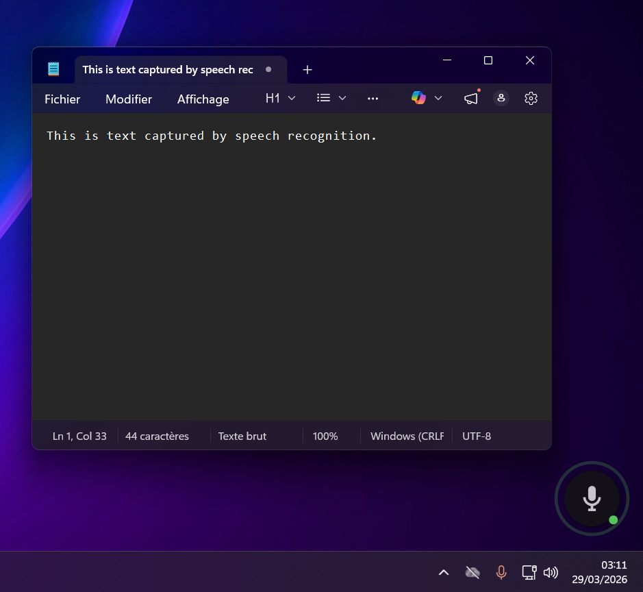

# VoxInject

**VoxInject** is a Windows dictation tool that transcribes your voice in real time and injects the text directly into any focused application — no copy-paste, no switching windows.

Press a hotkey, speak, release. The text appears where your cursor is.



---

## Features

- **Universal injection** — works in any app that accepts keyboard input (browser, IDE, chat, email…)
- **Real-time transcription** — streaming WebSocket, words appear as you speak
- **Hotkey modes** — Toggle (press once to start, once to stop) or Push-to-talk
- **Auto-punctuation** and custom vocabulary boost
- **Auto-enter** — presses Enter automatically after a configurable silence timeout
- **Plugin architecture** — swap or add transcription providers without recompiling
- **Secure secret storage** — API keys encrypted with Windows DPAPI, never stored in plaintext
- **Minimal UI** — animated overlay widget + systray icon, no taskbar entry

---

## Requirements

- Windows 10 or later (x64)
- [.NET 8 Desktop Runtime](https://dotnet.microsoft.com/download/dotnet/8.0) (if using the framework-dependent build)
- A microphone
- An API key from a supported transcription provider (currently: [AssemblyAI](https://www.assemblyai.com/))

---

## Installation

### Download (recommended)

[](https://github.com/olivierpetitjean/VoxInject/releases/latest/download/VoxInject-setup.exe)

Download **[VoxInject-setup.exe](https://github.com/olivierpetitjean/VoxInject/releases/latest/download/VoxInject-setup.exe)** and run it.
No admin rights required. Installs in `%LocalAppData%\Programs\VoxInject`.

> Windows may show a SmartScreen warning on first run — this is expected for unsigned open-source software. Click **More info → Run anyway**.

### Build from source

```bash
git clone https://github.com/olivierpetitjean/VoxInject.git
cd VoxInject
dotnet build -c Release
```

The output is in `src/VoxInject/bin/Release/net8.0-windows/`.
The AssemblyAI plugin is automatically copied to the `plugins/` subfolder by the build.

---

## Quick start

1. Launch `VoxInject.exe` — it sits in the systray.
2. Open **Settings** (double-click the icon or right-click → Paramètres).
3. Paste your AssemblyAI API key in the **API** tab.
4. Click **Enregistrer**.
5. Click into any text field, then press **Ctrl+Alt+V** (default hotkey) and speak.

The text is injected live. Press the hotkey again (or release, in Push-to-talk mode) to stop.

> **Warning badge on the systray icon** means no API key is configured or the last session failed.

---

## Plugin system

VoxInject discovers transcription providers at startup by scanning the `plugins/` folder for DLLs named `VoxInject.Providers.*.dll`.

To add a new provider:

1. Create a .NET 8 class library that references `VoxInject.Providers.Abstractions`.
2. Implement `ITranscriptionProvider` and `ITranscriptionService`.
3. Drop the compiled DLL into the `plugins/` folder next to `VoxInject.exe`.

See [CONTRIBUTING.md](CONTRIBUTING.md) for a step-by-step guide.

---

## Configuration

All settings are stored in `%AppData%\VoxInject\settings.json`.
API keys are encrypted with Windows DPAPI in `%AppData%\VoxInject\secrets\`.
A diagnostic log is written to `%AppData%\VoxInject\debug.log` on each session.

---

## Contributing

See [CONTRIBUTING.md](CONTRIBUTING.md).

---

## License

[MIT](LICENSE)
